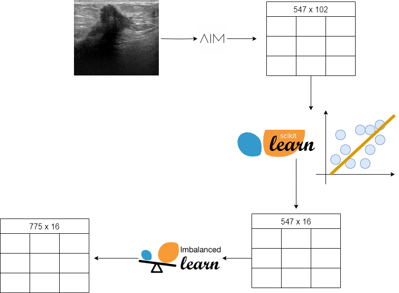
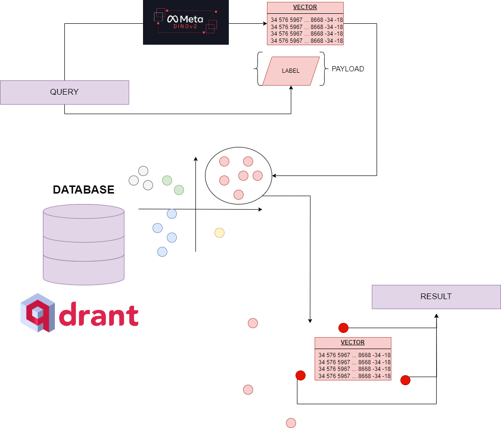
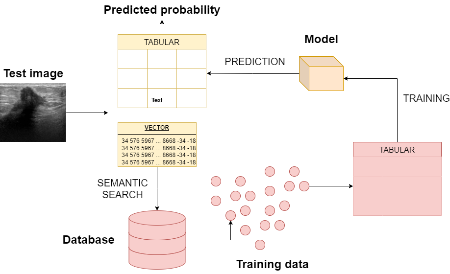

<h1 align="center">breastcancer-contextml</h1>
<h2 align="center">Predicting Breast Cancer Malignity Using Contextual Machine Learning</h2>

<div align="center">
    
   
   
   
   <div>
        <a href="https://astrabert.github.io/breastcancer_contextml"></a>
        <p><i>This image was generated with <a href="https://pollinations.ai/">Pollinations AI</a> API</i></p>
   </div>
</div>

> ⚠️: _The hereby provided software is a low-level academic project developed in the context of the course "Machine Learning in Health Care", held in Spring Term 2024 by professor Christian Salvatore and professor Claudia Cava._

> _The code is entirely written with the sole purpose of taking part in **Automatic Diagnosis of Breast Cancer | IUSS 23-24** Kaggle competition, and **MUST NOT** be used for diagnostics. The authors are not responsible of any misuse or out-of-scope use of the software._

In this project, developed as a possible solution to the **Automatic Diagnosis of Breast Cancer | IUSS 23-24** Kaggle competition, we explored how on-spot training could enhance traditional machine learning methods performance on tabular data, applying this to the prediction of breast cancer malignity from ultrasound images.

To reproduce our results, make sure to go through the following steps:

<h3 align="center">1. Set up local environment</h3>
First of all, clone this GitHub repository:

```bash
git clone https://github.com/AstraBert/breastcancer_contextml
```

Now go in the cloned folder and install all the needed dependencies:

```bash
cd breastcancer_contextml
python3 -m pip install -r scripts/requirements.txt
```

You will also have to pull Qdrant Docker image:

```bash
docker pull qdrant/qdrant:latest
```

Once the installation is complete, we can begin building!🚀

<h3 align="center">2. Preprocess the data</h3>
<br>
<div align="center">
    
</div>
<br>

The first piece of preprocessing, i.e. image feature extraction, has already been done (there are no images in this repository): the results, obtained through [pyradiomics](https://github.com/aim-harvard/pyradiomics), are saved in [extracted_features.csv](./data/extracted_features.csv). We have 547 training instances with 102 features, but:

- Not all the features are equally useful, and we want our model to be built on the best ones
- There is some imbalancing between benign and malignant training samples (benign ones are significantly more)

Thus we apply PCA (or _Principal Component Analysis_) to capture the features that encompass most of the variability in the dataset and we resample the training instances so that there is equilibrium between the two classes, using SMOTE (*Synthetic Minority Oversampling Technique*).

```bash
python3 scripts/preprocessing.py
```

Now we have all the training data, consisting of 775 instances and 16 features, in [combined_pca.csv](./data/combined_pca.csv) and all the test data in [extracted_test_pca.csv](./data/extracted_test_pca.csv).


<h3 align="center">3. Build the back-end contextual architecture</h3>
<br>
<div align="center">
    
</div>
<br>
In this step we perform:

- Vectorization of training and test data with dinov2-large by Facebook-Meta > 547 + 100 1024-dimensional vectors
- Creation of a Qdrant collection with training  data vectors
- Implementation of a back-end semantic search architecture

```bash
docker run -p 6333:6333 -v $(pwd)/qdrant_storage:/qdrant_storage:z qdrant/qdrant
python3 scripts/qdrant_collection.py
```

<h3 align="center">4. Train and test the model</h3>
<br>
<div align="center">
    
</div>
<br>
In this step:

- For each testing image, selected PCA features are extracted with pyradiomics
- Each testing vectorized instance, the 250 most similar images in the Qdrant collection are chosen
- A HistGradientBoosting Classifier is trained on tabular data for the 250 selected training images
- The trained model predicts the test instance, then moves forward

```bash
python3 scripts/contextual_machine_learning.py
```

<h3 align="center">5. PROs and CONs of the approach</h3>

#### PROs

* On-spot training:
* Less data to train
* Highly customizable
* Potentially extensible to other machine learning and deep learning frameworks such as neural networks, and also with AI
* Training is test-oriented 
* Good overall performance

#### CONs

* Slow and computationally intense
* Needs good-quality and well preprocessed data
* Needs a solid backend contextual architecture
* Needs a lot of trial and error before finding the right context window size

<h3 align="center">6. License and Rights of Usage</h3>

The hereby presented software is open-source and distributed under MIT license.

As stated before, the project was developed for learning purposes and must be used only in this sense.
